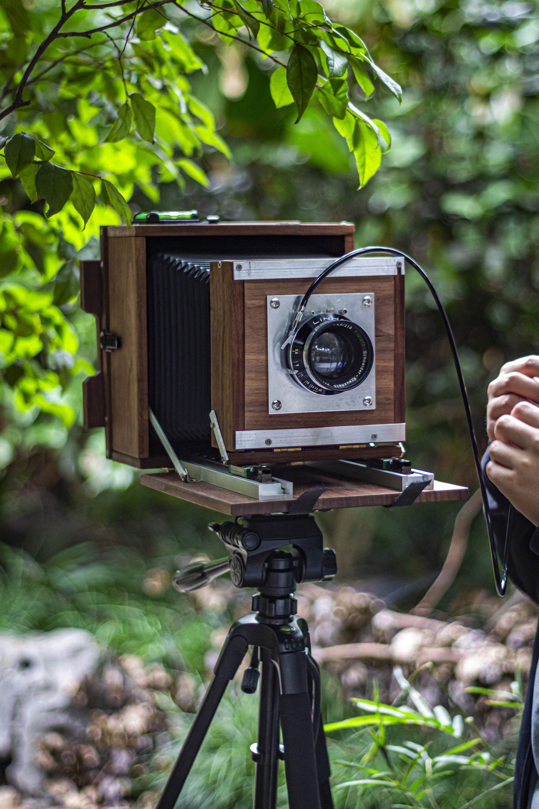
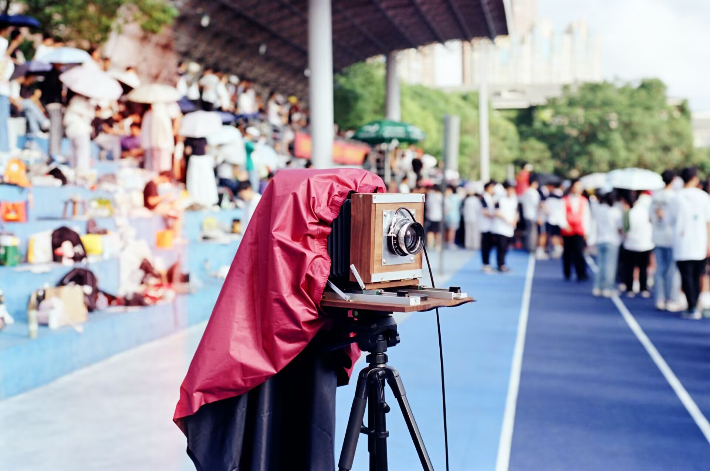

# 木制 5x7 大画幅双轨座机

###### 【Designed by SoTWild】 

我好像很久没有更新新的内容了~~（2年）~~，这次为大家带来的并不是嵌入式领域的研究，而是一种（相对）古典的**胶片摄影器材制作尝试和分享**。该器材并非当下常见的数码设备，而是一种——如标题所见——**大画幅相机系统**。

上脚架演示

------

## 概述：

最早的大画幅相机应该是 **乔瑟夫·尼舍弗朗·尼埃普斯** *(Joseph Nicéphore Nièpce)* 所做，他使用这种相机曝光约 8 小时，于 1816 年拍摄了世界上第一张永久性照片——《窗外的风景》。

窗外的风景

以下是一种大画幅相机实物图：

Chamonix 沙慕尼大画幅

更多有关的专业资料这里不再过多赘述，接下来让我们进入本篇的 DIY 主题。

### 这是一台怎样的相机：

#### 画幅：

首先大画幅**主要**分为三种规格：

> 4x5
>
> 5x7
>
> 8x10

每种规格的两个数值代表了所拍摄的**胶片底片的长宽**（英寸），这里我选择了 **5x7** 的规格进行设计。

#### 材质：

对于机身，我选择了**黑胡桃木**来打造，胡桃木有较高的硬度，可以支撑将近 **2KG** 的机身。胡桃木是从网上购买的，可以直接将要定制的规格参数发给客服加工。此外，我还拜托好友对其进行了二次加工，包括但不限于**打磨**以及上**木蜡油**，于是机身因此能达到一种良好的色泽质感。

#### 操作：

很遗憾的是，限于本人技术~~（想象力）~~不足，没能设计出**移轴等技术动作**的机构，故本大画幅相机丧失了此作为大画幅相机最重要的功能之一。

相机的前组前后伸缩范围约为 $$13-30cm$$ ，所以保留了不错的微距放大功能，放大倍率可 $$＞1$$ 。

120胶片的像占了对焦屏大半宽度

另外一个不足之处是相机的对焦机构为**滑块-导轨**的组合，没有设计限位或者锁止，容易出现位移，不过**阴差阳错**下把滑块的滚珠全部去除后阻尼良好，实拍下来焦点极准。

该相机是“饭盒机”，可以将其**收纳**为手提箱大小，大大方便了携带。

收纳形态

#### 镜头：

镜头（快门）可以适配**林哈夫** *(Linhof)* 的 **1 号**快门（$$Φ≈42mm$$）。

我目前使用的快门和镜头相互适配，快门挡位依次是 *T B 1 1/2 1/5 1/10 1/25 1/50 1/100 1/200 1/400*；光圈由 *f/5.6 ~ 45（f/12 ~ 45）*；带预览以及闪光灯 **PC** 接口（M/X挡）。

镜头为**施耐德** *(Schneider)* 的 *"Schneider - Kreuznach Symmar 1:5,6/210 1:12/370"* 双焦段镜头。这个镜头的具体表现可以查看[Schneider - Kreuznach Symmar 1:5,6/210](https://nikongear.net/revival/index.php?topic=2637.0)或者[Linhof Schneider Symmar 210/370mm convertible lens](https://www.largeformatphotography.info/forum/showthread.php?41873-Linhof-Schneider-Symmar-210-370mm-convertible-lens-Newbie-Question)，算是中规中矩。镜头前组可以加装 $$58mm$$ 滤镜。

镜头加装快门的实物图

#### 胶片：

大画幅系统的胶片通常是极其昂贵的，加上 5x7 胶片规格特殊，所以要找到合适的胶片有一定难度。不过我们有乐凯的**飞机卷**。

这里我使用了标准的 **5x7** （窄边126mm）大小的**乐凯 1025** 进行拍摄，将 **ISO 设置为 50**。

注意拍摄这张照片的是一只 190mm f/2.8 全开的投影仪镜头

#### 冲洗：

这里尝试了 **D76**（7min） 以及**雷电露**（8min）进行冲洗。

> ##### 雷电露主要步骤：
>
> ①预湿 1min
>
> ②显影 8min
>
> ③定影 1min

> 显影液：1:50 250ml
>
> 定影液：250g Na~2~S~2~O~3~·5H~2~O + 15g Na~2~SO~3~ + 10g NaBO~2~ 定容至 1000ml

冲洗-盘显 图示为一张1025 4x5大小底片（D76）

冲洗-盘显 图示为一张1025 5x7大小底片（雷电露1:50）

底片负负得正的尝试

------

## 制作：

### 机身：

以下是每块木头的参数表格：

##### 后组：

| 序号 | 规格（mm）    | 数量 | 备注     |
| ---- | ------------- | ---- | -------- |
| 1    | 200 * 80 * 10 | 2    | 后组框架 |
| 2    | 220 * 80 * 10 | 2    | 后组框架 |
| 3    | 220 * 20 * 10 | 2    | 取景压板 |
| 4    | 180 * 45 * 10 | 2    | 取景压板 |
| 5    | 180 * 10 * 10 | 2    | 取景挡条 |
| 6    | 130 * 10 * 5  | 1    | 取景挡条 |
| 7    | 130 * 15 * 10 | 1    | 取景器   |
| 8    | 195 * 15 * 10 | 2    | 取景器   |
| 9    | 160 * 40 * 10 | 1    | 取景器   |

> ⑨号需异形加工

##### 前组：

| 序号 | 规格（mm）     | 数量 | 备注                |
| ---- | -------------- | ---- | ------------------- |
| 10   | 160 * 50 * 10  | 2    | 前组框架            |
| 11   | 140 * 50 * 10  | 2    | 前组框架            |
| 12   | 140 * 140 * 10 | 1    | 镜头板（挖孔Φ86mm） |
| 13   | 160 * 10 *10   | 1    | 运动平台            |

##### 底板：

| 序号 | 规格（mm）     | 数量 | 备注 |
| ---- | -------------- | ---- | ---- |
| 14   | 220 * 220 * 10 | 1    | 底板 |

> 注意：其中有大概 4 块板是多余的，可以用于备用。

### 以下是所需的五金件：

##### 五金/其他：

| 序号 | 名称            | 规格                             | 数量 | 备注                      |
| ---- | --------------- | -------------------------------- | ---- | ------------------------- |
| 1    | 304 不锈钢带    | 0.2mm * 1cm * 1m                 | 1    | 压片弹簧                  |
| 2    | 磨砂亚克力      | 150 * 200 * 2mm                  | 1    | 对焦屏（定制裁13 * 18cm） |
| 3    | U 型骑马卡      | 固定直径 3mm                     | 4    | 固定压片弹簧传动轴        |
| 4    | 204 不锈钢轴    | 3mm * 140                        | 1    | 固定压片弹簧的传动轴      |
| 5    | 角码            | 12 * 15mm                        | 4    | 镜头板限位（自带螺丝）    |
| 6    | T 型滑条        | 滑条 20 滑槽 20cm                | 2    | 滑轨 1（定制）            |
| 7    | 滑块            | MGN9 200mm                       | 2    | 滑轨 2                    |
| 8    | 铰链合页        | 铜芯小合页                       | 4    | 翻转合页                  |
| 9    | 鸭嘴搭扣        | 49 * 21mm                        | 4    | 固定取景板                |
| 10   | 硬板纸          | 黑 A4 1.5mm                      | 10   | 片夹                      |
| 11   | C类覆黑胶春亚纺 | 1.4 * 1m                         | 1    | 皮腔表里材料              |
| 12   | 自攻螺丝        | M2.2 * 20/M2 * 12/M3 * 6/M3 * 25 | 100  | 固定框架                  |
| 13   | 遮光绒          | 0.5 * 500 * 1500                 | 1    | 修饰                      |
| 14   | 魔术贴          | 20 * 5000mm（勾面带胶/毛面无胶） | 1    | 固定                      |
| 15   | 1060/6061 铝    | 100 * 100 * 2mm/2 * 15 * 1000mm  | 2    | 杂项/镜头板挡板           |
| 16   | 提手            | 128孔距                          | 1    | 提手                      |
| 17   | T型水平仪       | 三角T架                          | 1    | 机身水平仪                |
| 18   | 阿卡            | PU150                            | 1    | 快装板                    |

##### 以及需要定制的铝件，我将其图纸放在了 sheet 文件夹

得进车间

### 关于片夹：

5x7 专业片夹价格并非高中生可以轻易承受（≈300￥），所以仍然 DIY。我自主设计了一种稳定性较高的片夹，采用 $$3mm$$ 厚度**黑卡纸**搭配 **502 胶水**层叠而成，尺寸适配本机身。图纸在 **sheet** 文件夹。

> 后来研究标准片夹时，发现其尺寸在长边上与本相机恰好适配，而窄边上需一共加长 1cm，另外对焦屏位置需微调。完成这些工作可以装配标准片夹。~~（使用更放心）~~

### 皮腔：

皮腔是大画幅相机最重要的组成部分之一，这里我托另一个朋友使用了两层**春亚纺**，衬条使用激光切割机制作。具体的皮腔制作教程可以查阅[大画幅相机皮腔的传统做法—理论部分[玄学咖啡E07]](https://www.bilibili.com/video/BV1PD4y1Y7Yj)。

科技改变生活

### 其他：

其他 DIY 常用的工具在此不一一列举，马不停蹄工作的话半个月可以完成所有准备和组装。对于有关细节问题和处理可以联系[我](https://space.bilibili.com/482469487)。~~（开学失踪）~~

制作过程

------

## 样片：

相机

1025 正冲

1025 ISO 50 f/5.6 1/10s D76 7min

惊人的解析力

1025 ISO 50 f/10 1/5s D76 7min

局部放大

1025 ISO 50 f/22 1/25s 雷电露1:50 8min

1025 ISO 50 f/5.6 1/10s 雷电露1:50 8min

###### 样片中黑点为飞机卷通病；漏光为片夹问题，已有解决方案。每张底片可以达到约 4 亿像素分辨率。

------

## 参考资料：

[摄影200年，发明摄影术的故事](https://museum.xiangshenghang.com/story/200years.html)